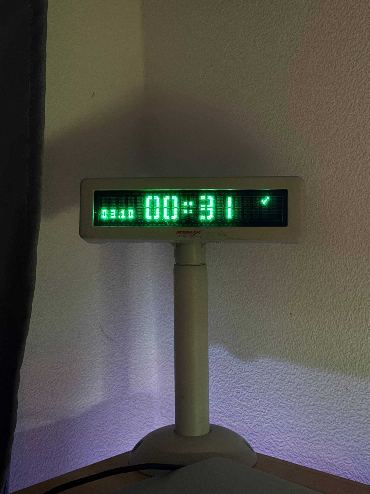

# Часы Posiflex на ESP32-S3



Прошивка для ESP32-S3 N16R8 выводит время на дисплей Posiflex 20×2 в режиме Epson. Четыре крупные цифры занимают две строки в центре, двоеточие мигает раз в секунду. Слева снизу показана дата `дд.мм` маленьким пиксельным шрифтом, справа сверху — один значок состояния сети:

| Значок | Состояние |
| --- | --- |
| × | Wi-Fi не подключён |
| ~ | Wi-Fi есть, интернет недоступен |
| ✓ | Интернет доступен |

Плата получает время по NTP и показывает его по московскому часовому поясу (UTC+3). Состояние интернета проверяется каждые 10 секунд: после двух неудачных проверок значок меняется на `~`, после успешной — на `✓`.

Пиксельные символы загружаются в дисплей при подключении. Затем прошивка обновляет только изменившиеся ячейки, не очищая экран при смене минуты.

## Подключение

- Компьютер подключается к разъёму **COM** платы для прошивки и просмотра журнала.
- USB дисплея подключается к отдельному разъёму **USB** платы, который работает через USB-OTG ESP32-S3. Дисплею нужно питание; если USB платы не подаёт 5 В, обеспечь питание или используй активный USB-хаб.
- Прошивка открывает VCOM/CDC-ACM дисплея на скорости 9600 8N1 и восстанавливает соединение после переподключения USB.

## Сборка и прошивка

Нужен [ESP-IDF 6.1](https://docs.espressif.com/projects/esp-idf/en/v6.1/esp32s3/get-started/index.html). Из корня проекта:

```sh
cd firmware
idf.py set-target esp32s3
idf.py menuconfig  # Posiflex clock → SSID и пароль Wi-Fi
idf.py build
idf.py -p PORT -b 115200 flash monitor
```

Вместо `PORT` укажи порт платы: например, `/dev/cu.usbmodem…` на macOS. `sdkconfig` с настройками Wi-Fi и каталог `build/` исключены из Git. `sdkconfig.defaults` задаёт 16 МБ flash, увеличенный раздел приложения и два NTP-сервера.

Исходники ESP32 находятся целиком в [firmware](firmware): отрисовка и сеть — в `main/`, NTP — в `components/board_time/`. Зависимость USB Host CDC-ACM фиксируется в `main/idf_component.yml` и `dependencies.lock`.

Код и фотография распространяются по [лицензии MIT](LICENSE).
